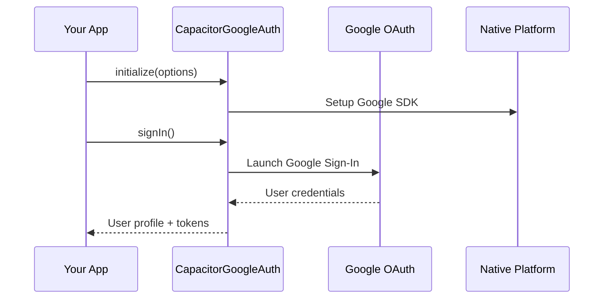

# CapacitorGoogleAuth - Project Overview

## What is CapacitorGoogleAuth?

CapacitorGoogleAuth is a **Capacitor plugin** that provides Google Authentication functionality for cross-platform mobile and web applications. It enables developers to integrate Google Sign-In into their Ionic, Angular, Vue, React, or vanilla JavaScript applications with a single, unified API that works across iOS, Android, and web platforms.

## Key Features

- **Cross-Platform Support**: Works on iOS, Android, and web with the same API
- **Capacitor 5 Compatible**: Built for the latest version of Capacitor
- **TypeScript Support**: Full TypeScript definitions included
- **OAuth 2.0 Integration**: Implements Google OAuth 2.0 authentication flow
- **Offline Access**: Supports server-side authentication with refresh tokens
- **Framework Agnostic**: Works with Angular, Vue, React, and vanilla JavaScript

## Project Architecture

### Core Components

```
├── src/
│   ├── definitions.ts    # TypeScript interfaces and types
│   ├── index.ts         # Main plugin registration
│   └── web.ts           # Web platform implementation
├── ios/
│   └── Plugin/          # iOS native implementation (Swift)
├── android/
│   └── src/main/java/   # Android native implementation (Java/Kotlin)
└── demo/                # Example implementations
```

### How It Works

1. **Plugin Registration**: The plugin registers itself with Capacitor's plugin system
2. **Platform Detection**: Automatically detects the platform (iOS, Android, or web)
3. **Native Bridging**: Uses Capacitor's native bridge to communicate with platform-specific implementations
4. **Google API Integration**: 
   - **Web**: Uses Google's JavaScript API (gapi)
   - **iOS**: Uses GoogleSignIn SDK
   - **Android**: Uses Google Sign-In for Android

### Authentication Flow



## Platform-Specific Features

### Web Platform
- Uses Google's JavaScript Platform Library
- Supports meta tag configuration
- Handles CORS and domain verification
- Provides real-time user state changes

### iOS Platform
- Integrates with GoogleSignIn iOS SDK (v6.2.4)
- Handles URL scheme configuration
- Supports Keychain storage for secure token management
- Implements native iOS authentication UI

### Android Platform
- Uses Google Sign-In for Android
- Handles app signing and SHA fingerprints
- Supports both debug and release configurations
- Implements native Android authentication flow

## Use Cases

### 1. Mobile Apps
Perfect for Ionic or Capacitor apps that need Google authentication:
```typescript
await GoogleAuth.initialize();
const user = await GoogleAuth.signIn();
// Use user.authentication.accessToken for API calls
```

### 2. Web Applications
Seamless integration for web apps:
```typescript
GoogleAuth.initialize({
  clientId: 'your-client-id.apps.googleusercontent.com',
  scopes: ['profile', 'email']
});
```

### 3. Server-Side Integration
Enable offline access for server-side operations:
```typescript
GoogleAuth.initialize({
  grantOfflineAccess: true,
  serverClientId: 'your-server-client-id'
});
// Access user.serverAuthCode for backend authentication
```

## Configuration Options

The plugin supports various configuration options through `capacitor.config.json`:

```json
{
  "plugins": {
    "GoogleAuth": {
      "scopes": ["profile", "email"],
      "serverClientId": "your-server-client-id",
      "forceCodeForRefreshToken": true,
      "clientId": "your-web-client-id",
      "iosClientId": "your-ios-client-id", 
      "androidClientId": "your-android-client-id"
    }
  }
}
```

## Development Workflow

### Building the Plugin
```bash
npm install    # Install dependencies
npm run build  # Compile TypeScript to JavaScript
```

### Platform Setup
- **iOS**: Configure URL schemes and GoogleService-Info.plist
- **Android**: Setup OAuth client IDs and app signing certificates
- **Web**: Configure authorized domains in Google Console

## API Reference

### Core Methods
- `initialize(options?)`: Setup the plugin with configuration
- `signIn()`: Initiate Google Sign-In flow
- `refresh()`: Refresh authentication tokens
- `signOut()`: Sign out the current user

### Return Types
- `User`: Complete user profile with authentication tokens
- `Authentication`: Access, ID, and refresh tokens
- `InitOptions`: Configuration options for initialization

## Fork Information

This is a fork of the original `@codetrix-studio/capacitor-google-auth` plugin, maintained as `@cubaka14/capacitor-google-auth`. The fork aims to provide continued support and updates for the Google Auth functionality in Capacitor applications.

## Contributing

This project welcomes contributions for:
- Bug fixes and improvements
- Platform-specific enhancements
- Documentation updates
- Demo applications
- Feature parity with official Google Auth libraries

The project follows the principle of maintaining alignment with official Google authentication libraries and supporting the latest Capacitor versions.